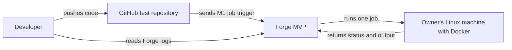
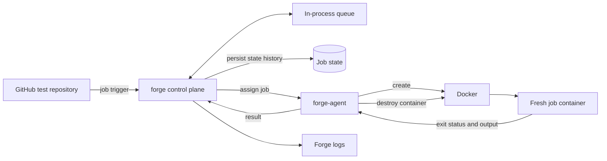

# MVP Architecture

The MVP is milestone M1: one job runs end to end on one machine. This is the target architecture. It is not implemented.

## System context

The developer pushes code to a GitHub repository. Forge receives a job trigger and runs the job on the owner's machine. The job result is available in Forge logs.

## Component view

## Parts

### GitHub test repository

A push starts one job through the temporary M1 trigger.

### `forge` control plane

Receives the job, records its state, queues it, assigns it to the worker, and records the result.

### In-process queue

Holds jobs waiting to run. It exists inside `forge` for M1.

### Job state

Stores each transition: queued, assigned, running, and the final result.

### `forge-agent`

Runs on the worker machine. It receives one job from `forge` and manages its container.

### Docker

Creates a container with configured resource limits for each job. The container and its writable layer are removed after the job.

### Fresh job container

Runs one job and is never reused.

### Forge logs

Show whether the job passed or failed.

## Example

1. A developer pushes a commit to the test repository.
2. The M1 trigger sends one job to `forge`.
3. `forge` records the job as queued and assigns it to `forge-agent`.
4. `forge-agent` creates a fresh Docker container and runs the job.
5. The container returns its output and exit status.
6. `forge-agent` destroys the container.
7. `forge` records the final state and writes the result to its logs.
