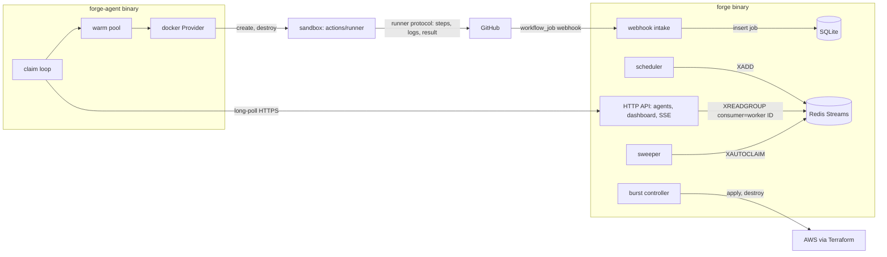
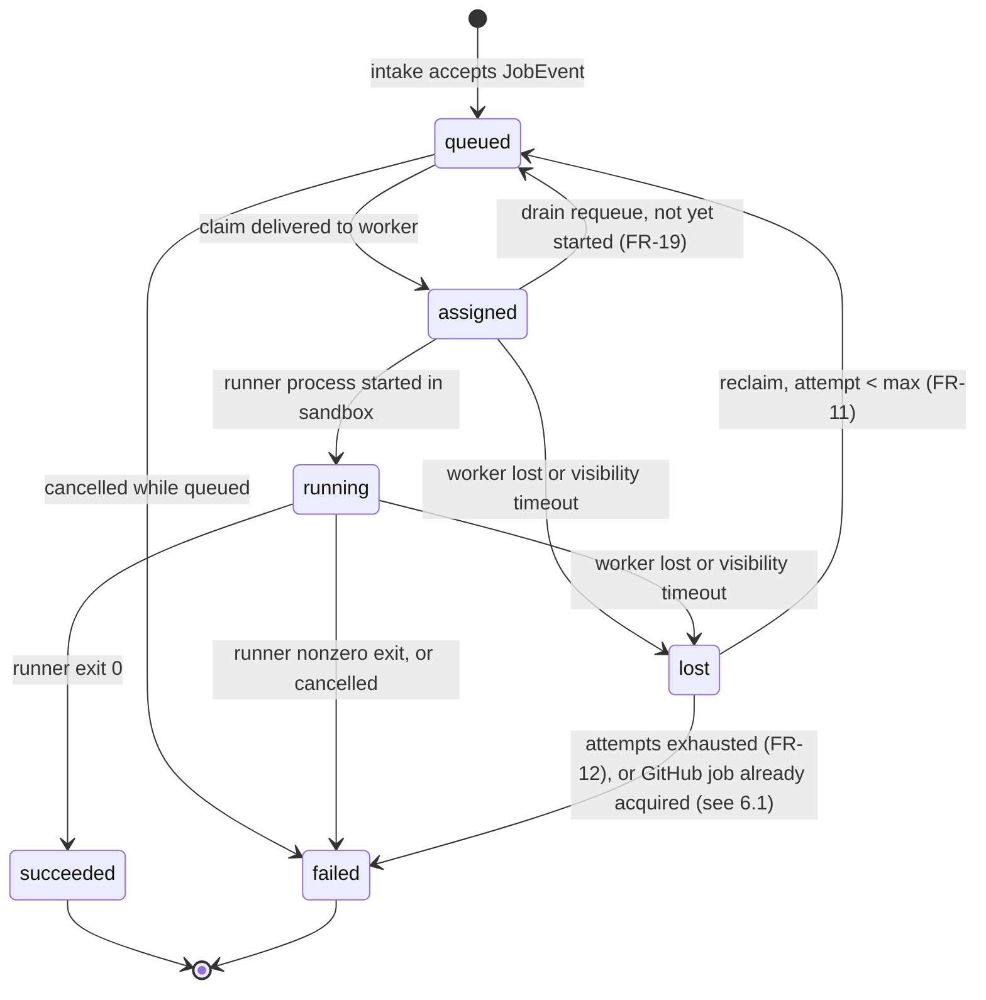

# Forge - Technical Design Document

**Version:** 1.0 | **Date:** August 13, 2026 | **Owner:** Charles Bai
**Companion docs:** `docs/specs/fs.md` (what Forge does), `docs/foundational/project-charter.md` (scope authority).

## 1. Context

`fs.md` defines what Forge does; this document defines the mechanism. It fixes the data model, the wire contracts between `forge` and `forge-agent`, the job and worker state machines, and the interface seams (`RunnerSource`, `Sandbox`) that `fs.md` §1.1 requires, and it resolves the five open questions in `fs.md` §7. Implementation work from M1 onward builds against this document.

## 2. Goals and non-goals

### Goals

- At-least-once dispatch with single-execution fencing: a job survives any single worker death (FR-11, NFR-3) and no attempt's result is accepted twice.
- Single-use sandboxes enforced by construction, not by convention: the `Sandbox` interface has no reuse path (FR-13).
- One exposed network surface: agents, the dashboard, and GitHub webhooks all terminate at one HTTPS listener on the control plane (FR-27).
- Control-plane restart safety: accepted jobs are durable before anything else observes them (NFR-3).
- GitHub result fidelity by delegation: the official Actions runner runs inside the sandbox, so FR-6 holds without reimplementing the runner protocol.

### Non-goals

- No high-availability control plane. One `forge` process per install; safety on restart, not failover. NFR-4 (5 workers, 50 concurrent jobs) fits a single node (§8), and failover would require external coordination that violates the single-binary principle (`fs.md` §1.1.1).
- No queue abstraction. §9 OQ2 fixes Redis Streams; the interface-seam principle applies to `RunnerSource` and `Sandbox` only. A queue interface would be speculative flexibility with no requirement behind it.
- No reimplementation of the GitHub Actions runner protocol. The protocol is large and undocumented; the official `actions/runner` binary ships in the sandbox base image instead.
- No artifact storage beyond logs, no GHES support, no runner-group management (`fs.md` §5, and §9 OQ5 below).
- No defense against kernel-level container escapes. Deferred to the Firecracker sandbox in v1.1 (FR-28).

## 3. High-level design

Two decisions shape everything else.

**Agents dial in; the control plane owns Redis.** `forge-agent` initiates every connection, speaking JSON over HTTPS to the control plane's single listener: long-poll to claim work, POST to report status and logs, POST to heartbeat. The control plane performs all Redis Streams operations, using the worker's ID as the consumer-group consumer name, so FR-11's claim semantics hold while workers never hold Redis credentials. This keeps one revocable credential per machine (FR-27) and lets burst workers on AWS (FR-21) enroll with nothing but the control plane URL and a token.

**SQLite is the source of truth; Redis is only delivery.** Every job, state transition, worker record, and secret lives in an embedded SQLite database in the data directory (pure-Go driver, `modernc.org/sqlite`, keeping NFR-6's no-CGO constraint). Redis Streams carries pending work to consumers and nothing else. A job is written to SQLite before it is enqueued, so a control-plane crash at any point loses no accepted job (NFR-3); a reconciler repairs the stream from SQLite on startup.



The components named here (`intake`, `scheduler`, `sweeper`, `burst controller`, `claim loop`, `warm pool`, `Provider`) are the units of §4.

## 4. Detailed design

### 4.1 Data model [M1, workers M3]

```go
type JobState string

const (
	JobQueued    JobState = "queued"
	JobAssigned  JobState = "assigned"
	JobRunning   JobState = "running"
	JobSucceeded JobState = "succeeded"
	JobFailed    JobState = "failed"
	JobLost      JobState = "lost"
)

// Job is the control plane's record of one unit of work (FR-9).
type Job struct {
	ID           string   // ULID, assigned at intake
	Source       string   // "github"
	ExternalID   int64    // GitHub workflow_job ID
	Repo         string   // "owner/name"
	RunID        int64    // GitHub workflow run ID
	Labels       []string // runs-on labels (FR-4)
	State        JobState
	Attempt      int    // 0 while queued, incremented on each claim (§4.7)
	WorkerID     string // worker holding the current attempt, if any
	DeadLettered bool   // FR-12: terminal failed after max attempts
	Reason       string // terminal detail: exit code, "cancelled", "worker_lost"
	CreatedAt    time.Time
	UpdatedAt    time.Time
}

// Transition is one row of append-only state history (FR-9).
type Transition struct {
	JobID   string
	Attempt int
	From    JobState
	To      JobState
	Reason  string
	At      time.Time
}

type WorkerState string

const (
	WorkerActive   WorkerState = "active"
	WorkerCordoned WorkerState = "cordoned"
	WorkerDraining WorkerState = "draining"
	WorkerLost     WorkerState = "lost"
	WorkerRemoved  WorkerState = "removed"
)

// Worker is one enrolled machine (FR-18).
type Worker struct {
	ID        string // ULID, assigned at enrollment
	Name      string // hostname, informational
	Labels    []string
	Capacity  int // max concurrent jobs
	State     WorkerState
	Burst     bool // provisioned by the burst controller (FR-21)
	Healthy   bool // last heartbeat's Docker reachability
	LastSeen  time.Time
	TokenHash []byte // SHA-256 of the per-machine token (FR-27)
	Arch      string // amd64 | arm64 (NFR-6)
	Version   string // agent build version
}
```

The SQLite schema for these types is in Appendix A. `Transition` rows are append-only and queryable from the dashboard and CLI, which satisfies FR-9's "persisted and queryable" directly with SQL.

### 4.2 Job state machine [M1, reclamation M3]

Every transition is named; anything not in this diagram is rejected by the state store with an error.



`lost` is transitional, never terminal: the sweeper always moves a lost job to `queued` or `failed`, so every job reaches a terminal state (NFR-3). Dead-lettering (FR-12) is `failed` with `DeadLettered = true`, which the dashboard surfaces with the attempt history and logs; keeping FR-9's six states avoids a seventh state that behaves identically to `failed` everywhere except one dashboard filter.

**Attempt fencing.** Each dispatch increments `Job.Attempt`, and every agent report carries the attempt number it was assigned. The control plane accepts `running` and terminal reports only for the current attempt. A worker that reconnects after its attempt was reclaimed gets its report rejected, destroys its sandbox, and moves on. This is what makes at-least-once delivery (FR-11) safe: a stale attempt can waste work but can never write a result.

### 4.3 Worker state machine [M3]

| From | To | Trigger |
|---|---|---|
| (none) | active | enrollment with a valid one-time token (FR-3) |
| active | cordoned | operator cordon (FR-19) |
| cordoned | active | operator uncordon |
| active, cordoned | draining | operator drain (FR-19) |
| draining | cordoned | drain complete: assigned-not-started jobs requeued, running jobs finished |
| active, cordoned, draining | lost | 3 consecutive missed heartbeats (FR-20) |
| lost | active | heartbeat resumes with the same per-machine token; no new enrollment token needed (FR-20 clean re-enroll) |
| cordoned, lost | removed | operator remove; token revoked (FR-27) |

`removed` is terminal. A removed machine re-enrolls as a new worker with a new enrollment token.

### 4.4 The RunnerSource seam [M2]

`RunnerSource` is the seam between Forge and a CI provider (`fs.md` §1.1.5). v1.0 ships one implementation, `github`.

```go
// JobEvent is a provider-side job notification, normalized.
type JobEvent struct {
	Kind       string // "queued" | "in_progress" | "completed"
	ExternalID int64
	Repo       string
	RunID      int64
	Labels     []string
	Conclusion string // set when Kind == "completed"
}

// JITConfig is a single-use runner credential bound to one job attempt.
type JITConfig struct {
	RunnerID int64  // provider-side registration ID
	Encoded  string // opaque blob passed to the runner binary
}

type RunnerSource interface {
	// VerifyAndParse authenticates a webhook delivery (HMAC for
	// github) and returns the job events it carries (FR-4, FR-27).
	VerifyAndParse(r *http.Request) ([]JobEvent, error)

	// RegisterJIT creates a single-use runner registration for one
	// attempt (FR-4, FR-5). Called at claim time, once per attempt.
	RegisterJIT(ctx context.Context, job *Job) (*JITConfig, error)

	// Unregister removes a registration whose credential was never
	// consumed, used when an attempt is reclaimed (FR-11).
	Unregister(ctx context.Context, runnerID int64) error

	// ListQueued returns provider-side queued jobs matching the
	// configured labels, for startup and periodic reconciliation
	// against missed webhooks (NFR-3).
	ListQueued(ctx context.Context) ([]JobEvent, error)
}
```

**The github implementation [M2].** Registration is per repo, or per org when the credential allows it (FR-7). `RegisterJIT` calls the generate-jitconfig endpoint scoped to the configured repo or org. The JIT config is consumed by the official `actions/runner` binary inside the sandbox, which then speaks the runner protocol to GitHub directly: step execution, live logs, and the final result all appear in the GitHub UI exactly as with hosted runners (FR-6), because it is the same runner. Forge's own terminal state comes from the runner process exit code and is corroborated by the `completed` webhook.

JIT registration happens at claim time, not at webhook time. Registering at intake would create registrations that sit unconsumed while the job queues and would orphan a registration every time an attempt is reclaimed; claim-time registration means one registration per actual execution attempt, which is what FR-5's single-use rule is about. Reclaimed attempts whose credential was never consumed are cleaned up via `Unregister`.

**Credential mode.** GitHub App is the primary mode; a classic PAT is the documented fallback for Persona A quick starts. Decision detail in §9 OQ1.

### 4.5 The Sandbox seam [M1, hardened M4]

Implemented in `forge-agent`. v1.0 ships one `Provider`, `docker`.

```go
// Spec is the per-job sandbox configuration (FR-13, FR-14).
type Spec struct {
	Image       string  // configured base image with actions/runner installed
	CPU         float64 // e.g. 2.0
	MemoryBytes int64
	PIDs        int64
	DiskBytes   int64 // writable-layer quota
	Hardened    bool  // FR-15 profile, default true from M4
}

// Provider creates sandboxes. There is deliberately no method that
// returns an existing sandbox for reuse: Create is the only source,
// and it always builds a fresh container (FR-13).
type Provider interface {
	Create(ctx context.Context, spec Spec) (Sandbox, error)
}

type Sandbox interface {
	ID() string

	// Start launches the runner process inside the sandbox with the
	// attempt's JIT credential (FR-4). Start returns an error if
	// called twice; a sandbox executes at most one job.
	Start(ctx context.Context, jitEncoded string) error

	// Wait blocks until the runner process exits and returns its
	// exit code.
	Wait(ctx context.Context) (int, error)

	// Logs streams combined stdout and stderr from process start.
	Logs(ctx context.Context) (io.ReadCloser, error)

	// Destroy force-removes the container and its writable layer.
	// Idempotent. Destroy is the only way a Sandbox leaves scope;
	// the interface has no Reset or Release (FR-13).
	Destroy(ctx context.Context) error
}
```

Single-use is structural: nothing in the interface can hand a used sandbox to a second job, and the agent calls `Destroy` in a deferred path that runs on success, failure, cancellation, and panic. The FR-17 isolation suite additionally asserts at the Docker API level that no container ID is ever reused.

**Hardened profile (FR-15) [M4].** `Hardened: true` maps to: no host network (default bridge with inter-container communication disabled), `--security-opt no-new-privileges`, all capabilities dropped except the documented baseline, Docker's default seccomp profile, non-root user, read-only host mounts limited to the image's own content, and the FR-14 resource limits. The exact capability and seccomp baseline is documented in the threat model (FR-28) and asserted by the isolation suite (FR-17).

**Warm pool (FR-16) [M4].** The agent keeps up to `warm_pool_size` (default 2) sandboxes per configured label set: created and started, runner installed but idle, waiting for a credential. On claim, the agent takes a warm sandbox if one exists, otherwise falls through to a cold `Create`. `Start` injects the JIT config into the already-running container via the Docker exec API. The pool refills asynchronously after each take. Warm sandboxes are ordinary `Sandbox` values: taken once, destroyed after their one job, so FR-13's invariant is unchanged. NFR-1's under-2s warm start is the pool's acceptance test.

### 4.6 Wire contract: agent API [M1 in-process, M3 over HTTPS]

All endpoints require the worker's bearer token except `enroll`, which requires a one-time enrollment token (FR-3, FR-27). JSON bodies throughout.

| Endpoint | Purpose |
|---|---|
| `POST /v1/agents/enroll` | one-time token in, worker ID and per-machine token out (FR-3) |
| `POST /v1/agents/{id}/heartbeat` | liveness, capacity, health (FR-18, FR-20) |
| `GET /v1/agents/{id}/claim` | long-poll for the next job (FR-10, FR-11) |
| `POST /v1/jobs/{id}/attempts/{n}/status` | running and terminal reports (FR-9) |
| `POST /v1/jobs/{id}/attempts/{n}/logs` | chunked log upload (FR-26) |

```go
// ClaimResponse is delivered when the long-poll matches a job.
type ClaimResponse struct {
	JobID   string `json:"job_id"`
	Attempt int    `json:"attempt"`
	JIT     string `json:"jit"`  // JITConfig.Encoded
	Spec    Spec   `json:"spec"` // sandbox spec, resolved server-side
}

type Heartbeat struct {
	Capacity int      `json:"capacity"`
	Running  []string `json:"running"` // job IDs currently held
	Healthy  bool     `json:"healthy"` // Docker daemon reachable
}

type StatusReport struct {
	State    JobState `json:"state"` // running | succeeded | failed
	ExitCode *int     `json:"exit_code,omitempty"`
	Reason   string   `json:"reason,omitempty"`
}
```

`claim` blocks server-side on `XREADGROUP BLOCK` with consumer name set to the worker ID, up to 30s, then returns 204 and the agent re-polls. A claim is delivered only after the control plane verifies the worker is `active` and the job is still `queued` in SQLite (this is where cancelled-while-queued jobs are dropped: acknowledged in the stream, skipped, marked failed with reason `cancelled`).

The same listener serves the dashboard (embedded static assets via `embed.FS`, FR-24), `GET /v1/jobs/{id}/logs/stream` for SSE log tailing (§4.8), `POST /webhook/github`, and `/metrics` in Prometheus format (FR-25). TLS is on by default with a self-signed certificate generated at setup; the bootstrap command embeds the certificate fingerprint and agents pin it (§7).

### 4.7 Critical path: job submission through result [M2, queue semantics M3]

1. GitHub delivers a `workflow_job` `queued` webhook. `github.VerifyAndParse` checks the HMAC signature and yields a `JobEvent` (FR-4, FR-27).
2. Intake inserts a `Job` with `State: queued` and a `Transition` into SQLite in one transaction. The job now survives any crash (NFR-3).
3. The scheduler `XADD`s the job ID to the `forge:jobs` stream. One stream suffices because v1.0 has one configurable label set (FR-7). A crash between steps 2 and 3 is repaired by the startup reconciler, which re-enqueues any `queued` job absent from the stream.
4. An agent's long-poll reaches `claim`. The control plane `XREADGROUP`s with consumer = worker ID and verifies job and worker state in SQLite. It calls `RegisterJIT`; on success it increments `Attempt`, transitions `queued -> assigned`, commits, and returns a `ClaimResponse` (FR-10). A `RegisterJIT` failure leaves the job `queued` and the stream entry pending for retry (§6.6).
5. The agent takes a warm sandbox or `Create`s a cold one, calls `Start` with the JIT credential, and reports `running` (transition `assigned -> running`).
6. The runner inside the sandbox executes the job, streaming steps and logs to GitHub over the runner protocol (FR-6). In parallel the agent copies `Logs` output to the control plane in chunks (FR-26).
7. `Wait` returns the exit code. The agent posts a terminal `StatusReport` for its attempt, then `Destroy`s the sandbox (deferred, unconditional).
8. The control plane validates the attempt number (fencing, §4.2), transitions to `succeeded` or `failed`, `XACK`s the stream entry, and closes the job's log file. The `completed` webhook later corroborates the terminal state; a mismatch is logged as a warning and the webhook's conclusion wins, since GitHub's view is the user-visible one.

Every step names a type or component defined above; there is no machinery on this path that §4 does not define.

### 4.8 Log pipeline [M2 files, M3 SSE]

Per-job logs are files: `<data-dir>/logs/<job-id>-<attempt>.log`, appended by the chunked upload endpoint. Live tailing is Server-Sent Events: the dashboard opens `GET /v1/jobs/{id}/logs/stream` and receives the file's tail as it grows (FR-24). SSE over WebSocket is a §9 OQ3 decision: the stream is strictly one-directional, SSE needs no additional dependency or upgrade handling, and it reconnects natively with `Last-Event-ID`. Retention: logs older than 30 days or beyond a 5 GiB total cap are deleted oldest-first, both configurable (FR-2). A failed job's transitions, attempts, and full log are all reachable from the dashboard alone (FR-26).

### 4.9 Sweeper: liveness and reclamation [M3]

One control-plane loop, every 10s:

1. Mark workers with `LastSeen` older than 30s (3 missed 10s heartbeats) as `lost` (FR-20).
2. `XAUTOCLAIM` stream entries idle longer than the 60s visibility timeout. For each, transition the job's current attempt to `lost`, `Unregister` its unconsumed JIT credential, then either requeue (`lost -> queued`, attempt < max) or dead-letter (`lost -> failed`, `DeadLettered: true`, FR-12, default max 2 attempts). The GitHub-acquired case is handled in §6.1.
3. Requeue `assigned` jobs on `draining` workers that never reported `running`; complete drains whose workers hold no running jobs (FR-19).

All defaults are in Appendix B and are exercised by the chaos suite (NFR-3), which is the check that the timings compose: visibility timeout > heartbeat loss threshold > heartbeat interval.

### 4.10 Burst controller [M5]

A control-plane loop compares queue depth to idle fleet capacity (FR-21):

- Scale up: depth exceeds capacity continuously for `burst_up_window` (default 120s). The controller runs the bundled Terraform module (`terraform apply` with `-var count=n`) to add instances, up to `burst_max_instances` (default 2). Instances cloud-init the FR-3 bootstrap one-liner with a pre-issued enrollment token, so a burst worker is an ordinary worker with `Burst: true`.
- Scale down: depth below `burst_down_threshold` for `burst_down_window` (default 600s). The controller drains the newest burst worker (FR-19 semantics: running jobs finish, FR-22), then destroys its instance.
- Caps: `burst_max_instances` and `burst_max_hours_per_day` (default 12) are enforced before every apply; a hit cap is a dashboard banner and a metric (FR-23).

The `terraform` binary is an external dependency of burst only: justified under `fs.md` §1.1.1 because the Terraform module is itself a charter deliverable, and the feature is off unless configured. Instance sizing, AMI strategy, and spot policy are §9 OQ4.

### 4.11 Interim M1 trigger [M1 only]

At M1 there is no JIT integration. A `workflow_job` webhook (signature-verified) triggers execution of a fixed, configured command in a fresh sandbox, with pass or fail visible in Forge logs, matching `mvp-architecture.md`. The queue is an in-process channel behind the same claim endpoint shape, so the agent code does not change at M3. This path is deleted at M2 and never documented for users (FR-8).

## 5. Alternatives considered

**Agent transport: gRPC bidirectional streams.** Rejected. gRPC would add protobuf, codegen, and a second serialization stack to serve five RPCs, against `fs.md` §1.1.1's rule that each dependency be justified. Long-poll JSON shares the mux, TLS, and auth with the dashboard and webhook listener, and is debuggable with curl. The cost, one idle reconnect every 30s per worker, is noise at NFR-4 scale (5 workers).

**Agents consume Redis Streams directly.** Rejected. It is the more literal reading of FR-11's claim model, but it makes Redis a second credentialed network surface on every worker, requires per-agent Redis ACL management to make FR-27 revocation real, and forces Redis exposure over the WAN for burst workers (FR-21). Consumer-group semantics are preserved by proxying the claim with consumer = worker ID (§4.6), which keeps FR-11's per-consumer pending-entry accounting intact.

**State store: Postgres or bbolt instead of SQLite.** Postgres rejected: an external database service contradicts the single-binary principle and would appear in every install, unlike Redis which §9 OQ2 already mandates from M3. bbolt rejected: FR-9 requires queryable state history and the dashboard needs ad-hoc queries (filters, durations, attempts); rebuilding indexing and querying over a KV store is more code than SQL. The pure-Go SQLite driver is slower than CGO builds, acceptable because SQLite is not on the hot claim path, and it preserves NFR-6.

**Reimplement the runner protocol instead of shipping actions/runner in the image.** Rejected. The protocol is undocumented and large; any gap breaks FR-6's "exactly as with hosted runners." Delegation costs a bigger base image (hundreds of MB) and a runner-version upgrade obligation, both acceptable; warm pools (FR-16) already amortize image pull cost.

**JIT registration at webhook time instead of claim time.** Rejected. Registrations would sit unconsumed for the full queue wait, and every reclaimed attempt would orphan one. Claim-time registration gives one registration per execution attempt (FR-5) at the cost of one GitHub API call on the claim path, bounded by the same API budget either way.

**Warm pool via pause or CRIU checkpoint instead of idle running containers.** Rejected. `docker pause` saves negligible resources for an idle runner process, and CRIU checkpoint/restore is operationally fragile and unproven on arm64 (NFR-6). An idle started container already meets NFR-1's 2s budget since only credential injection and process start remain at claim time.

## 6. Failure modes

### 6.1 Worker dies mid-job

Heartbeats stop; the worker goes `lost` after 30s; the sweeper reclaims its pending entries after the 60s visibility timeout (FR-11, FR-20). Two windows differ on the GitHub side:

- **Before the in-sandbox runner acquired the GitHub job** (JIT credential unconsumed): the attempt is requeued, a new attempt registers a fresh JIT runner, and GitHub sees a single runner come online and execute. Fully transparent.
- **After acquisition**: GitHub binds a workflow job to one runner and fails it when that runner disappears; a second Forge attempt cannot reattach. The sweeper detects consumption via the runner registration state, transitions the job `lost -> failed` with reason `worker_lost`, and the `completed` webhook corroborates. Re-dispatch here would re-run user code against a job GitHub already failed, so it is deliberately not attempted.

In both windows the job reaches a terminal, accounted state, which is the NFR-3 "zero lost jobs" criterion; the chaos suite kills workers in both windows.

### 6.2 Control plane restarts

SQLite is the source of truth (§3). Before the reconciler runs, startup applies any pending forward-only schema migrations: numbered `.sql` files embedded in the binary via `embed.FS`, applied in one transaction, tracked by a single-row `schema_version` table (Appendix A). A milestone's new tables or columns (e.g., `admin` and `sessions` at M5) ship as a migration and apply automatically against an existing data directory on first start with the new binary; a failed migration exits before serving traffic, so an upgrade fails closed rather than running against a half-migrated schema. Then the reconciler: re-`XADD`s `queued` jobs missing from the stream; leaves `assigned` and `running` jobs alone if their worker still heartbeats, since agents buffer status reports and retry; calls `RunnerSource.ListQueued` to recover webhooks missed while down, and repeats that poll every 60s as a standing backstop, since GitHub webhook delivery is not guaranteed. Accepted jobs are never lost (NFR-3); at most, a job's dispatch is delayed by the restart.

### 6.3 Redis unavailable

Intake keeps accepting webhooks and writing SQLite; enqueue is deferred. Claims return 204, so agents idle. When Redis returns, the reconciler enqueues the backlog. The dashboard shows a degraded banner and `/metrics` exposes the condition. No state is lost because Redis never holds the only copy of anything (§3). This is also why §9 OQ2's compose file treats Redis restarts as routine.

### 6.4 Network partition between control plane and a running worker

The worker keeps its job running and buffers reports. The control plane marks it `lost` and the sweeper applies §6.1. If the partition heals after reclamation, the worker's terminal report carries a stale attempt number and is rejected by fencing (§4.2); the worker destroys its sandbox and discards the result. Consequence: work can be wasted, but a result is never accepted twice and two workers never run the same attempt (FR-11).

### 6.5 Docker daemon down on a worker

The agent's heartbeat reports `Healthy: false` and the claim loop stops polling; the control plane stops considering the worker for capacity (FR-18). An in-flight `Create` failure fails the attempt fast with reason `sandbox_error`, and the attempt requeues to the rest of the fleet.

### 6.6 GitHub API unavailable at claim time

`RegisterJIT` fails; the job never leaves `queued`, the stream entry stays pending, and the job is retried after backoff without consuming an attempt. Webhook outages are covered by the §6.2 polling backstop.

### 6.7 Terraform apply fails or burst caps hit

The burst controller logs the failure, raises a dashboard banner, and retries on the next evaluation window; the fleet keeps serving at its own capacity. Caps are checked before apply, so a failure cannot overshoot FR-23's limits. Instance-boot failures are covered by enrollment-token expiry: an instance that never enrolls is destroyed at the next scale-down evaluation.

### 6.8 Unhandled

Control-plane host disk loss destroys SQLite and with it job history and secrets; there is no replication in v1.0 (non-goal, §2). Acceptable because the source of durable CI truth for users is GitHub's UI (FR-6), and Forge state is reconstructible by re-enrolling workers. Backup is a documented operator task (copy the data directory).

## 7. Security

Design mechanisms serving FR-27 and FR-28; the threat model document itself is an M4 deliverable.

- **Secrets at rest (FR-27):** GitHub credentials and enrollment tokens are encrypted with NaCl secretbox before insertion into SQLite. The 32-byte key is generated at setup and stored at `<data-dir>/secret.key` with mode 0600. This defends against exposure of the database file alone, a stray backup, a misdirected copy, a bug that reads the DB but not the rest of the host, not against full data-directory or host compromise, where the key is equally exposed; that broader scenario is already out of scope per §6.8. Per-machine agent tokens are 32 random bytes, stored as SHA-256 hashes only (`Worker.TokenHash`); high token entropy makes a plain hash sufficient, no KDF needed.
- **Agent authentication (FR-27):** every agent request bears its per-machine token. Revocation from the dashboard deletes the hash and takes effect on the next request. Enrollment tokens are single-use and expire after 1 hour.
- **Transport:** TLS on by default via a certificate generated at setup; the FR-3 bootstrap command embeds its fingerprint and agents pin it, so enrollment over an untrusted network cannot be intercepted by a spoofed control plane. Operators can substitute their own certificate.
- **Webhook intake (FR-27):** GitHub deliveries are verified against the webhook secret via `X-Hub-Signature-256` before parsing (§4.4).
- **Admin authentication (FR-2, FR-27):** the single admin account is a username and Argon2id-hashed password, captured at setup (FR-2) and stored in a dedicated `admin` table (Appendix A), separate from the `secrets` table since a password hash is compared, not decrypted. `POST /v1/admin/login` checks the password and issues a random 32-byte session token; the browser holds it in an `HttpOnly; Secure; SameSite=Strict` cookie, and the control plane stores only the token's SHA-256 hash with a 24h expiry (`sessions` table, Appendix A), the same store-a-hash pattern used for `Worker.TokenHash`. Every dashboard-serving and `/v1/admin/*` route requires a valid, unexpired session; `POST /v1/admin/logout` deletes the session row. One admin account per install, matching `fs.md` §5's single-admin scope.
- **Isolation invariants (FR-28):** job-to-job contamination is prevented by single-use sandboxes with no reuse path in the type system (§4.5) plus the M4 hardened profile; host persistence by no writable host mounts and non-root execution; runner reuse by claim-time single-use JIT registration (FR-5). Each claim maps to an FR-17 test (§8). Kernel-level container escapes are explicitly out of scope until the Firecracker sandbox (v1.1), and the threat model says so.

## 8. Testing plan

Each row is the test that proves a design decision holds. Suites: `unit` (per package, every PR), `integration` (Docker required, every PR), `isolation` and `chaos` (main branch, FR-17 and NFR-3), `bench/` (NFR-1, NFR-2). NFR-7 fixes the CI gates (build, vet, staticcheck, race).

| Design decision | Verifies | Test | Suite |
|---|---|---|---|
| State machine transitions (§4.2, §4.3) | FR-9, FR-19, FR-20 | table-driven: every legal transition accepted, every other pair rejected | unit |
| Attempt fencing (§4.2) | FR-11 | stale-attempt report rejected; job result unchanged | unit |
| SQLite-before-Redis ordering (§4.7) | NFR-3 | fault injection: crash between insert and XADD; reconciler re-enqueues | integration |
| Single-use sandbox (§4.5) | FR-13, FR-17 | `Start` twice errors; `Destroy` runs on success, failure, cancel, panic; Docker API shows no container ID reused across jobs | isolation |
| Hardened profile (§4.5) | FR-15, FR-17 | in-sandbox probes: no host net, caps dropped, non-root, cross-job file persistence absent, other containers invisible, limits enforced | isolation |
| Reclamation both windows (§6.1) | FR-11, FR-12, NFR-3 | 50+ trials of `kill -9` on workers pre- and post-acquisition; all jobs terminal, no double execution, dead-letter after max attempts | chaos |
| Control-plane restart (§6.2) | NFR-3 | kill control plane at each critical-path step; all accepted jobs reach terminal states | chaos |
| Redis outage (§6.3) | NFR-3 | stop Redis under load; backlog drains after restart, no job lost | chaos |
| Warm start latency (§4.5) | NFR-1, FR-16, FR-25 | p95 queued-to-executing under 2s warm, under 5s cold, measured from FR-25 metrics on the reference host | bench/ |
| 2x speedup claim | NFR-2 | reference workload vs `ubuntu-latest`, scripted methodology | bench/ |
| Single-node fleet scale (§2) | NFR-4 | 24h soak: 5 simulated workers, 50 concurrent jobs sustained, 1,000+ jobs completed; queue depth and NFR-1 latency stay in bounds, zero dropped or duplicated jobs | bench/ |
| Enrollment and revocation (§7) | FR-3, FR-27 | enrollment token single-use and expiring; revoked worker token rejected on next request | integration |
| JIT single-use (§4.4) | FR-5 | one registration per attempt; reclaimed unconsumed registrations unregistered | integration |
| Burst lifecycle (§4.10) | FR-21, FR-22, FR-23 | flood queue against localstack-or-real AWS: instances appear within window, drain before terminate, caps never exceeded | integration (M5) |

Every performance and security claim in the README cites a row of this table, per `fs.md` §1.1.4.

## 9. Open questions from fs.md §7: decisions

1. **GitHub App vs PAT.** GitHub App primary, classic PAT supported as fallback. App installation tokens are short-lived and repo-scoped, shrinking the FR-27 blast radius, and org-level registration (FR-7) works without a user account's broad PAT. PAT stays because Persona A's 10-minute setup (NFR-5) should not require creating and installing an App.
2. **Redis required from M3 vs embedded alternative.** Required for all installs from M3, including single-node, shipped in the compose file. This satisfies FR-10's queue-durability requirement; a second embedded queue would double the surface the chaos suite (NFR-3) must prove correct, for the benefit of removing one container from an install path that already requires Docker.
3. **Log transport and retention.** SSE, not WebSocket: the stream is one-directional and SSE reconnects natively with no added dependency (§4.8). Retention: per-job files, 30 days or 5 GiB cap, oldest first, configurable.
4. **Burst sizing, AMI, spot.** One configurable instance type, default `c7g.2xlarge` (Graviton: cheapest compute per vCPU, and NFR-6 already requires arm64). Stock Ubuntu 24.04 AMI resolved via the public SSM parameter plus cloud-init bootstrap; no baked AMI, because a Packer pipeline is standing maintenance and the burst windows already tolerate minutes of boot time. Spot is the default with an on-demand fallback flag: FR-11 reclamation makes a spot interruption identical to the worker-kill case the chaos suite already proves safe, so paying on-demand rates buys nothing.
5. **Org-level runner groups.** Deferred to v1.1, recorded in FUTURE.md. v1.0 registers org runners into the default runner group, which satisfies FR-7's "org-level registration if credentials allow"; managing custom groups adds API and dashboard surface with no v1.0 requirement behind it.

## Appendix A: SQLite schema

```sql
CREATE TABLE jobs (
    id            TEXT PRIMARY KEY,          -- ULID
    source        TEXT NOT NULL,             -- 'github'
    external_id   INTEGER NOT NULL,
    repo          TEXT NOT NULL,
    run_id        INTEGER NOT NULL,
    labels        TEXT NOT NULL,             -- JSON array
    state         TEXT NOT NULL,
    attempt       INTEGER NOT NULL DEFAULT 0,
    worker_id     TEXT,
    dead_lettered INTEGER NOT NULL DEFAULT 0,
    reason        TEXT,
    created_at    TEXT NOT NULL,
    updated_at    TEXT NOT NULL,
    UNIQUE (source, external_id)             -- webhook redelivery idempotency
);

CREATE TABLE transitions (
    id         INTEGER PRIMARY KEY AUTOINCREMENT,
    job_id     TEXT NOT NULL REFERENCES jobs(id),
    attempt    INTEGER NOT NULL,
    from_state TEXT NOT NULL,
    to_state   TEXT NOT NULL,
    reason     TEXT,
    created_at TEXT NOT NULL
);

CREATE TABLE workers (
    id         TEXT PRIMARY KEY,             -- ULID
    name       TEXT NOT NULL,
    labels     TEXT NOT NULL,                -- JSON array
    capacity   INTEGER NOT NULL,
    state      TEXT NOT NULL,
    burst      INTEGER NOT NULL DEFAULT 0,
    healthy    INTEGER NOT NULL DEFAULT 1,
    last_seen  TEXT NOT NULL,
    token_hash BLOB NOT NULL,
    arch       TEXT NOT NULL,
    version    TEXT NOT NULL
);

CREATE TABLE enrollment_tokens (
    token_hash BLOB PRIMARY KEY,
    expires_at TEXT NOT NULL,
    used_at    TEXT
);

CREATE TABLE admin (
    username      TEXT PRIMARY KEY,
    password_hash BLOB NOT NULL             -- Argon2id
);

CREATE TABLE sessions (
    token_hash BLOB PRIMARY KEY,            -- SHA-256 of the session token
    expires_at TEXT NOT NULL
);

CREATE TABLE schema_version (
    version INTEGER NOT NULL                -- single row, current migration number
);

CREATE TABLE secrets (
    name       TEXT PRIMARY KEY,             -- 'github_app_key', 'webhook_secret', ...
    ciphertext BLOB NOT NULL,                -- NaCl secretbox
    updated_at TEXT NOT NULL
);
```

## Appendix B: default tuning parameters

All settable via config file, flag, or env (FR-2). The chaos suite runs against these defaults; changing a default requires re-running it.

| Parameter | Default | Constraint |
|---|---|---|
| heartbeat interval | 10s | |
| worker lost threshold | 30s | 3 missed heartbeats |
| visibility timeout | 60s | must exceed lost threshold |
| max attempts (dead-letter) | 2 | FR-12 |
| claim long-poll timeout | 30s | |
| warm pool size per label set | 2 | FR-16 |
| log retention | 30 days / 5 GiB | oldest first |
| burst up window | 120s | FR-21 |
| burst down threshold window | 600s | FR-22 |
| burst max instances | 2 | FR-23, conservative |
| burst max hours per day | 12 | FR-23, conservative |
| enrollment token TTL | 1h | single-use |
